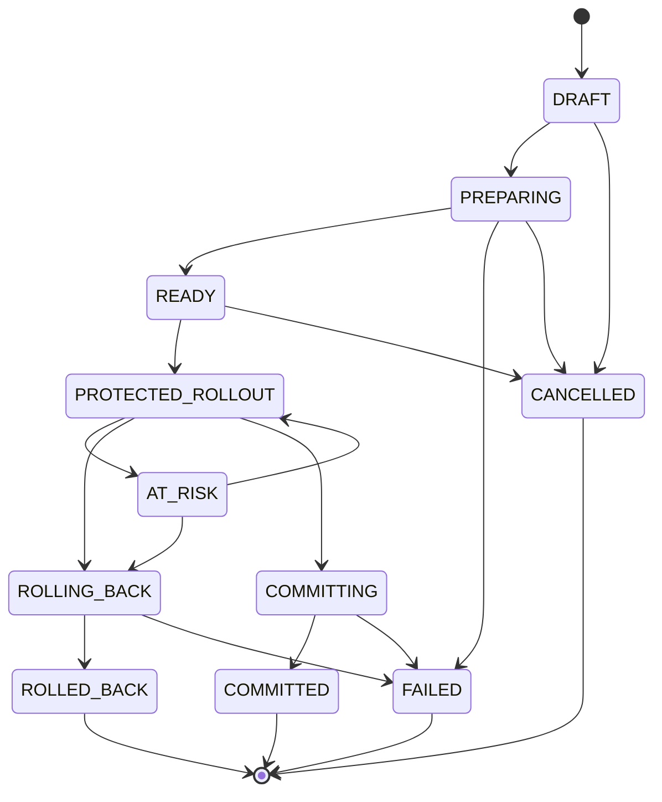

# Release Lifecycle

The full state machine lives in one place:
`release/domain/ReleaseState.java`. Every transition anywhere in the
system goes through `Release.transitionTo()`, which consults it — there
are no scattered booleans.

`COMMITTED` is deliberately a dead end in this graph — once committed, a
release can never transition to `ROLLING_BACK`. This is enforced by
`ReleaseState.canTransitionTo()`, not by convention, and is exercised
directly in `ReleaseStateTest` (Phase A) and indirectly in
`ReversibilityEvaluatorTest`.

## What drives each transition

| Transition | Triggered by |
|---|---|
| `DRAFT → PREPARING` | `POST /releases/{id}/prepare` |
| `PREPARING → READY` | `POST /releases/{id}/ready` |
| `READY → PROTECTED_ROLLOUT` | `POST /releases/{id}/contracts` (contract activation) — never a direct release-state call |
| `PROTECTED_ROLLOUT → ROLLING_BACK` | `POST /releases/{id}/rollback` |
| `ROLLING_BACK → ROLLED_BACK` | automatic, same request, after epoch invalidation succeeds |
| `PROTECTED_ROLLOUT → COMMITTING → COMMITTED` | `POST /releases/{id}/commit` |

## Epoch

`Release.epoch` starts at 0 and is bumped by exactly one, atomically with
the state write, every time a release enters `PROTECTED_ROLLOUT`. This is
the value tagged onto every `WorkJob` created while that protection is
active, and the value `EpochRegistry.invalidate()` is called with on
rollback. See `docs/features/WORK_FENCING.md`.

## Concurrency

Every transition goes through `ReleaseRepository.compareAndSave()`
(optimistic, expected-state-based) — see `docs/architecture/DATA_MODEL.md`
for how this maps to a DynamoDB conditional write. A losing caller gets a
structured `409 STATE_TRANSITION_FAILED`, not a silent no-op and not a
500.
