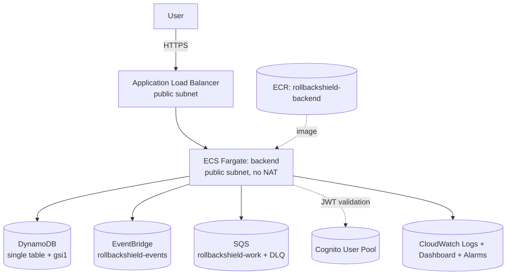

# AWS Architecture

Five CDK stacks (`infrastructure/lib/`): Network (VPC, public-only, zero
NAT Gateways), Data (DynamoDB + EventBridge + SQS), Identity (Cognito),
ControlPlane (ECR + ECS Fargate + ALB + IAM roles), Observability
(CloudWatch dashboard + alarms). All five synthesize successfully
(verified: `npm install && cdk synth --all`, real CloudFormation output
inspected for expected resource types).

## Why no NAT Gateway
The ECS service runs in public subnets with a security group allowing
inbound only from the ALB; outbound (ECR pull, DynamoDB/EventBridge/SQS
API calls) goes over the public AWS network directly. Trades network
isolation for avoiding NAT Gateway's per-hour + per-GB cost — the right
call for a personal-account hackathon deployment (see `COST_MODEL.md`),
revisit with private subnets + VPC endpoints once cost is less binding.

## Why ECS Fargate, not Lambda
ADR-002: long-running JVM, predictable health checks, no cold starts.

## Deployed vs. not
Nothing in this diagram has actually been deployed to a real AWS account
from this build — `cdk synth` was verified, `cdk deploy` was not run (no
AWS credentials in this environment). See `docs/operations/AWS_DEPLOYMENT.md`.

## Connector IAM (connectivity layer)

The task role additionally carries: `ObserveEcsRuntimes`, ECR
`VerifyArtifacts`, SQS/EventBridge/CloudWatch discovery, Secrets Manager
reads under `rollbackshield/*`, and `ExecuteControlledRollback`
(`ecs:UpdateService` on `service/*/*` only). Customer-account observation
uses STS AssumeRole (`sts:AssumeRole` on
`arn:aws:iam::*:role/RollbackShieldObservationRole` with an external-id
condition) — the control plane never holds customer keys. See
`infrastructure/lib/control-plane-stack.ts` and `docs/integrations/AWS.md`.

## Deployed frontend/API edge (hackathon)

The browser reaches the API directly through API Gateway HTTPS (	4dv6crzic.execute-api.ap-south-1.amazonaws.com) with a public HTTP proxy to the internet-facing ALB; CORS is restricted to the Amplify origin. This is a deliberate hackathon tradeoff (public ALB remains reachable, HTTP hop inside AWS, ~30s API Gateway integration timeout so synchronous rollback can 504 while continuing -- poll release state). See `docs/architecture/FRONTEND_API_EDGE.md` and `docs/adr/006-api-gateway-public-alb-hackathon-edge.md`; post-hackathon target is VPC Link + private ALB plus async rollback operations.
