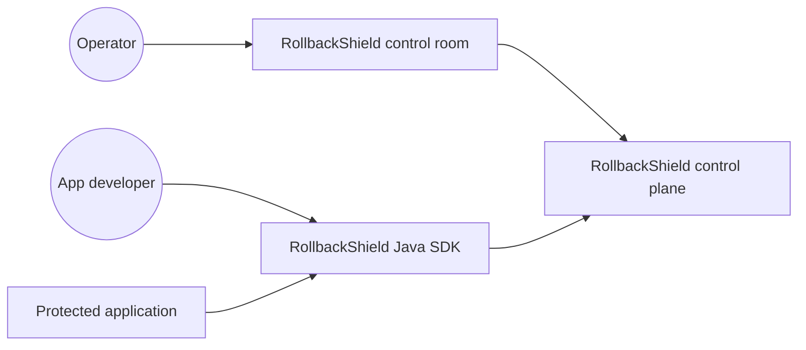
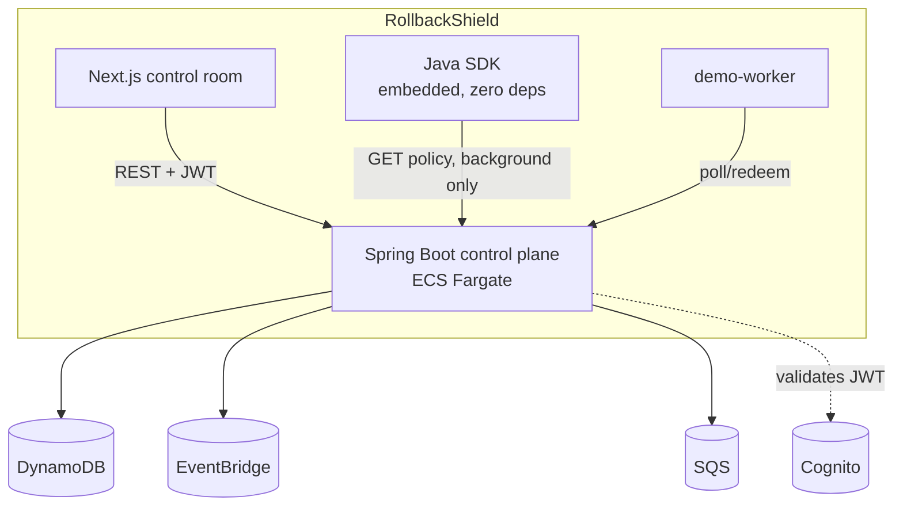
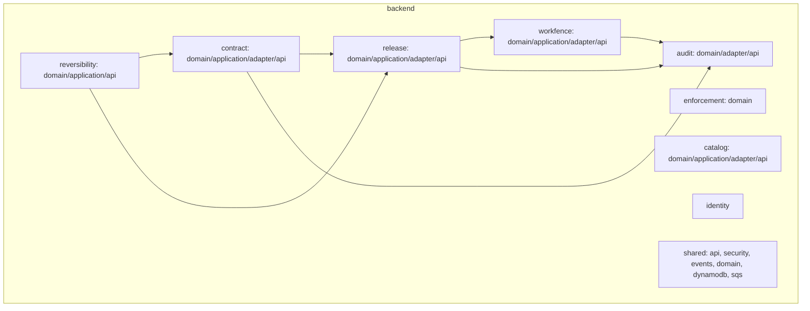

# C4 Model

## Level 1: System context

## Level 2: Containers

## Level 3: Components (control plane)

Every arrow above is an application-layer service calling another
application-layer service — never a controller calling another module's
repository directly (enforced by `ModuleBoundaryTest`).

## Level 4: Code
See the Javadoc on each `domain` class and `docs/DOMAIN_MODEL.md` — code
is the source of truth at this level, not a diagram that will drift.
