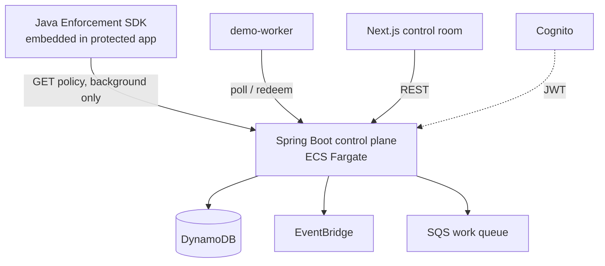
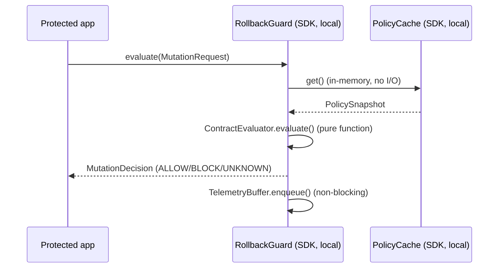
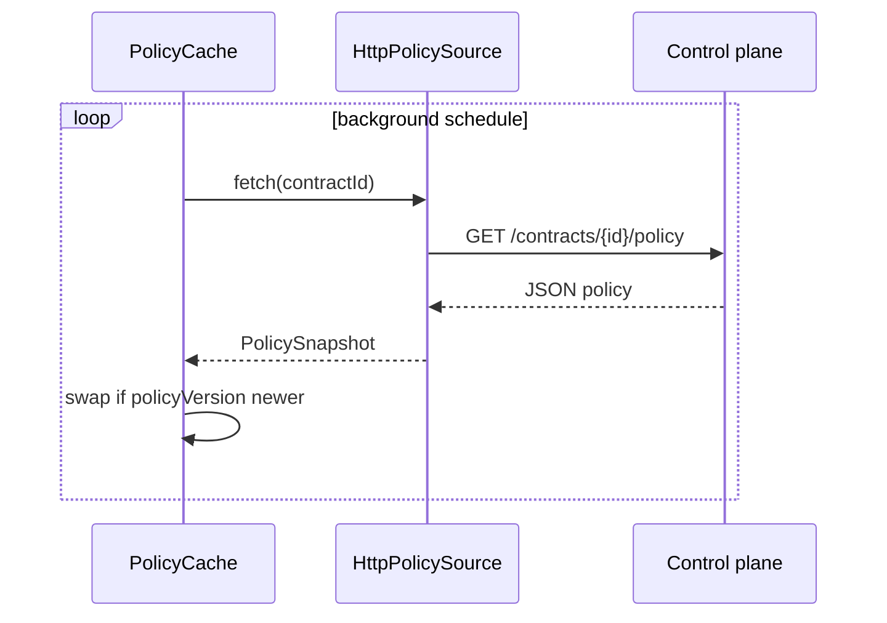
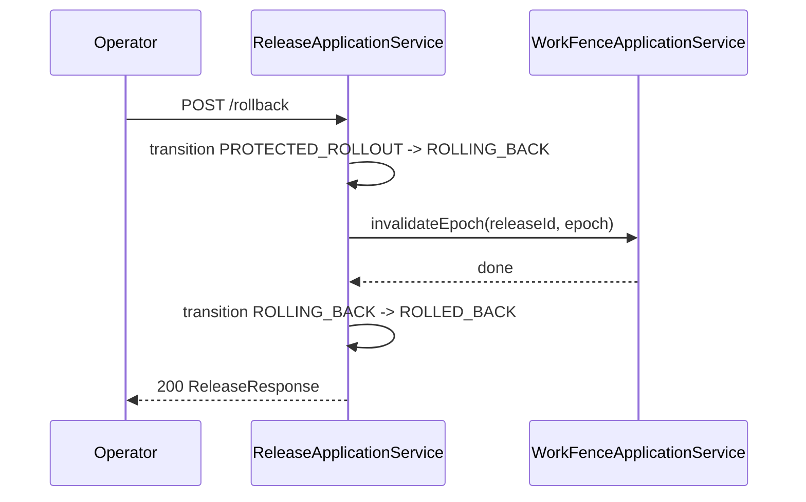

# System Design

## Problem / scope
See `docs/PRODUCT_OVERVIEW.md`. In scope for v0.1: release lifecycle,
rollback contracts, deterministic compatibility rules, local SDK
enforcement, work-epoch fencing, reversibility status, audit trail, one
demo app. Out of scope: everything in `docs/product/ROADMAP.md`.

## Container view

## Release state machine
See `docs/RELEASE_LIFECYCLE.md` for the full diagram.

## Mutation evaluation sequence

No network call anywhere in this sequence.

## Policy refresh sequence

## Work fence sequence
See `docs/features/WORK_FENCING.md`.

## Rollback sequence

## Consistency model
Release transitions: optimistic concurrency via
`ReleaseRepository.compareAndSave()` (expected-state precondition),
backed by DynamoDB's version-attribute conditional put. Audit trail:
append-only, no update path. Work redemption: first-writer-wins via
`ConcurrentHashMap.computeIfAbsent` (in-memory today — see LIMITATIONS.md
for the DynamoDB-backed version needed before scaling past one instance).

## Known limitations, tradeoffs, future direction
See `docs/product/LIMITATIONS.md` and `docs/product/ROADMAP.md`.
