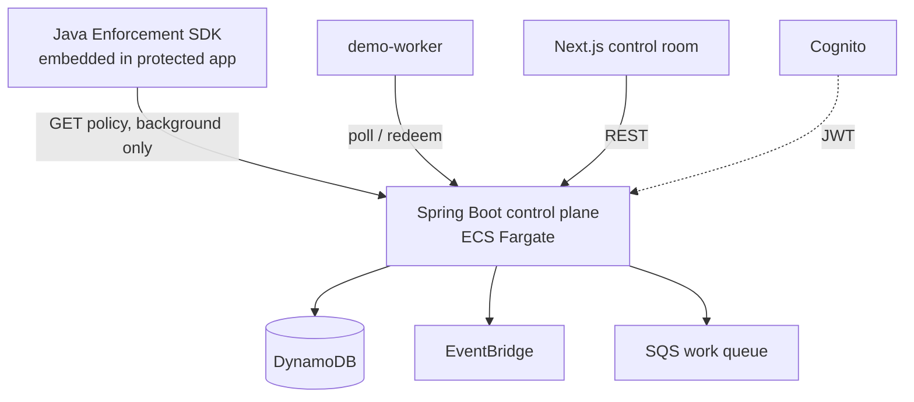
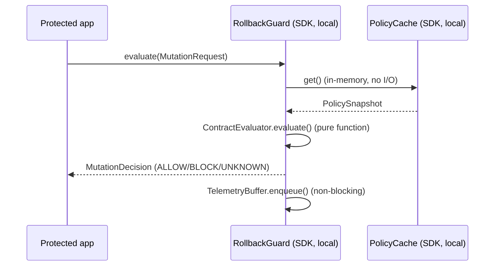
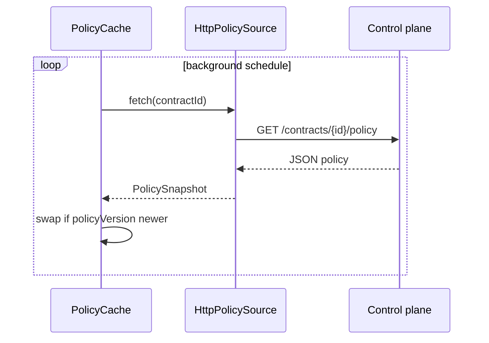
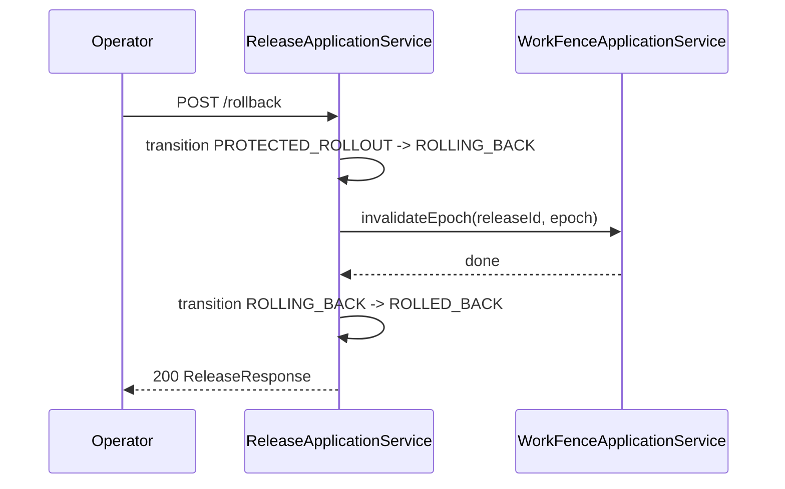

# System Design

## Problem / scope
See `docs/PRODUCT_OVERVIEW.md`. In scope for v0.1: release lifecycle,
rollback contracts, deterministic compatibility rules, local SDK
enforcement, work-epoch fencing, reversibility status, audit trail, one
demo app. Out of scope: everything in `docs/product/ROADMAP.md`.

## Container view

## Release state machine
See `docs/RELEASE_LIFECYCLE.md` for the full diagram.

## Mutation evaluation sequence

No network call anywhere in this sequence.

## Policy refresh sequence

## Work fence sequence
See `docs/features/WORK_FENCING.md`.

## Rollback sequence

## Consistency model
Release transitions: optimistic concurrency via
  `ReleaseRepository.compareAndSave()` (expected-state precondition),
  backed by DynamoDB's version-attribute conditional put. Audit trail:
  append-only, no update path. Work redemption: durable, multi-instance
  safe (DynamoDB condition + redemption ledger; ADR-005), with an
  in-memory implementation of the same ports for the `local` profile.

## Connectivity layer (implemented)

The control plane is also a connectivity product: integrations and
connectors observe connected systems, discovery and mapping build the
service model, deployment observation creates releases from real
deployments, and preflight/rollback execute against the connected runtime.
Start with `docs/architecture/CONNECTIVITY_MODEL.md`, then
`SERVICE_DISCOVERY.md`, `SERVICE_MAPPING.md`, `REVERSIBILITY_GRAPH.md`
and `docs/integrations/CONNECTOR_ARCHITECTURE.md`. The enforcement plane
(local SDK + work fence) is unchanged and remains off the network path.

The reversibility graph is not a separate subsystem: it is the structured
`checks` + `evidence` + `blockerPaths` assembled per request by the
reversibility application services from connectors, mappings, observation
records and contracts. Adding a runtime provider (ECS, Kubernetes) required
no core changes -- provider behavior is reached through capability ports,
enforced by `ModuleBoundaryTest` and `ProviderIndependenceTest`.

## Known limitations, tradeoffs, future direction
See `docs/product/LIMITATIONS.md` and `docs/product/ROADMAP.md`.

## Deployed frontend/API edge (hackathon)

The browser reaches the API directly through API Gateway HTTPS (	4dv6crzic.execute-api.ap-south-1.amazonaws.com) with a public HTTP proxy to the internet-facing ALB; CORS is restricted to the Amplify origin. This is a deliberate hackathon tradeoff (public ALB remains reachable, HTTP hop inside AWS, ~30s API Gateway integration timeout so synchronous rollback can 504 while continuing -- poll release state). See `docs/architecture/FRONTEND_API_EDGE.md` and `docs/adr/006-api-gateway-public-alb-hackathon-edge.md`; post-hackathon target is VPC Link + private ALB plus async rollback operations.
